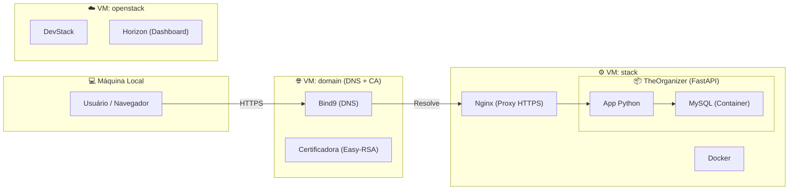

# 📅 TheOrganizer


O **TheOrganizer** é uma aplicação para gerenciamento de tarefas e organização pessoal, desenvolvida como parte da disciplina de DevOps. O projeto foca em uma arquitetura robusta de deploy utilizando nuvem privada, automação com Terraform e orquestração com Docker.

---

## 🚀 Documentação Completa (Notion)

Confira o roteiro detalhado de deploy e configuração da infraestrutura no nosso Notion:
👉 [**TheOrganizer - Guia de Deploy**](https://www.notion.so/theorganizer-34d09eb36fc280e48031d7d90907e7a6)

---

## 🏗️ Arquitetura da Infraestrutura

O deploy é realizado em um ambiente de nuvem privada utilizando **DevStack (OpenStack)** e **Multipass**.



---

## 🛠️ Tecnologias Utilizadas

- **Backend:** FastAPI (Python)
- **Banco de Dados:** MySQL 8.0
- **Infraestrutura:** 
  - [OpenStack (DevStack)](https://www.openstack.org/software/devstack/)
  - [Multipass](https://multipass.run/)
  - [Terraform](https://www.terraform.io/)
  - [Nginx](https://www.nginx.com/)
  - [Docker & Docker Compose](https://www.docker.com/)

---

## 💻 Como Rodar Localmente

### Pré-requisitos
- Python 3.11+
- MySQL (ou Docker)

### Passo a Passo
1. **Clone o repositório:**
   ```bash
   git clone https://github.com/milenahamerski/theorganizer.git
   cd theorganizer
   ```

2. **Crie e ative o ambiente virtual:**
   ```bash
   python3 -m venv .venv
   source .venv/bin/activate
   ```

3. **Instale as dependências:**
   ```bash
   pip install -r requirements.txt
   ```

4. **Inicie a aplicação:**
   ```bash
   uvicorn app.main:app --reload
   ```

---

## 🐳 Rodando com Docker

Se preferir rodar toda a stack (App + Banco) rapidamente:
```bash
docker-compose up -d
```


Desenvolvido por [Milena Hamerski](https://github.com/milenahamerski)
