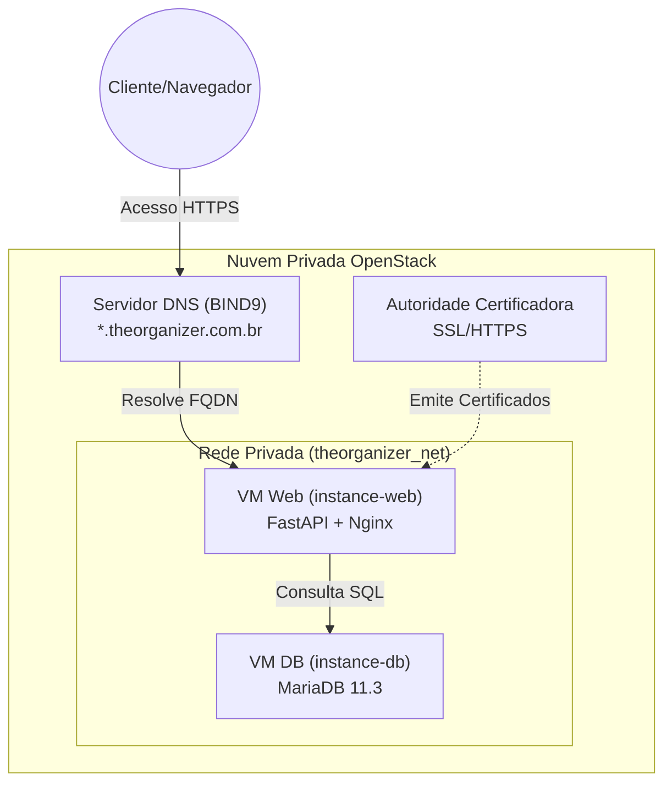

# 📑 ROTEIRO FINAL: Foco em Nuvem OpenStack e Infraestrutura

Este roteiro foi ajustado para dar ênfase total à gestão da Nuvem Privada, VMs, DNS e CA, conforme exigido no Trabalho 1.

---

## 📊 Arquitetura da Nuvem (Diagrama Mermaid)

---

## 🎙️ Script Mastigado para a Gravação (7 a 12 min)

### 1. Introdução e Empresa (Câmera no rosto) - [1:30 min]
*   **FALA**: "Olá, professor Hermano. Eu sou a Milena Hamerski e vou apresentar o projeto **TheOrganizer**. Minha empresa fictícia foca em organização de acervos e o nosso domínio oficial é `theorganizer.com.br`."
*   **FALA**: "O objetivo deste trabalho não é apenas o CRUD, mas a construção do zero de uma **Nuvem Privada OpenStack** para hospedar essa solução de forma profissional e isolada."

### 2. Explicação da Topologia (Mostre o Diagrama) - [2:00 min]
*   **AÇÃO**: Mostre o diagrama acima na tela.
*   **FALA**: "Para que o professor entenda o fluxo, preparei este diagrama da nossa arquitetura. O cliente acessa nossa nuvem via HTTPS. A requisição passa primeiro pelo nosso servidor **BIND9**, que resolve o FQDN para o IP da nossa VM Web."
*   **FALA**: "Dentro da nuvem OpenStack, temos uma rede privada isolada. A **instance-web** processa a lógica de negócio e se comunica com a **instance-db**, que está protegida e não aceita conexões externas, apenas da nossa rede interna."
*   **FALA**: "Toda essa estrutura é validada pela nossa própria Autoridade Certificadora, que emitiu os certificados SSL que vocês veem no cadeado do navegador."

### 3. OpenStack e VMs (Mostre o Dashboard ou Terminal) - [2:30 min]
*   **FALA**: "Seguindo a topologia ideal, criei um projeto na minha nuvem local. Configurei as redes virtuais e as regras de segurança (Security Groups) para isolar o tráfego."
*   **AÇÃO**: Mostre a lista de instâncias ou o arquivo de configuração.
*   **FALA**: "Instanciei duas máquinas virtuais principais: a **instance-web**, que recebe as requisições dos usuários, e a **instance-db**, que hospeda o MariaDB. Essa separação em instâncias distintas é fundamental para a segurança e escalabilidade do projeto."

### 4. DNS e Autoridade Certificadora (Mostre arquivos do BIND/OpenSSL) - [2:30 min]
*   **FALA**: "Para a resolução de nomes, configurei um servidor **BIND9**. Ele está gerenciando a zona `theorganizer.com.br`. Qualquer serviço sob este domínio, como o `cloud.theorganizer.com.br`, é resolvido internamente na nossa rede de nuvem."
*   **FALA**: "Também atendi ao requisito de segurança criando minha própria **Autoridade Certificadora (CA)**. Gere certificados digitais para o domínio, garantindo que o acesso à nuvem seja feito via HTTPS, protegendo os dados dos nossos clientes."

### 5. Demonstração da Aplicação (Navegador) - [2:00 min]
*   **AÇÃO**: Mostre o site funcionando (CRUD).
*   **FALA**: "A aplicação foi personalizada com o logotipo da TheOrganizer. É um sistema CRUD puro, sem módulos extras, focado na gestão de livros. Temos 5 campos: ID, Título, Autora, Ano e Capa."
*   **FALA**: "A integração entre as VMs é feita de forma transparente. A aplicação na VM Web se conecta ao MariaDB na VM de banco de dados via rede privada."

### 6. Diferencial Técnico (Nota Máxima) - [1:30 min]
*   **FALA**: "Como diferencial, implementei a **Automação Completa de Schema e Healthchecks**. O banco de dados se auto-configura via script `init.sql` no momento da criação da instância. Além disso, a aplicação web possui um monitor de saúde que aguarda o banco estar pronto antes de subir o serviço, garantindo alta disponibilidade desde o primeiro segundo."

### 7. Conclusão - [0:30 min]
*   **FALA**: "O projeto TheOrganizer demonstra minha capacidade de planejar redes, gerenciar identidades SSL, configurar DNS e orquestrar uma nuvem privada do zero. Obrigado!"

---

## 🛠️ Termos Técnicos para Usar e Impressionar:
- **FQDN (Fully Qualified Domain Name)**: Use ao falar do endereço `cloud.theorganizer.com.br`.
- **Security Groups**: Use ao explicar como liberou as portas 80/443 no OpenStack.
- **Provisionamento**: Use para descrever o ato de criar as VMs.
- **Criptografia de Ponta a Ponta**: Ao falar do SSL/HTTPS.

---

## 💡 Lembre-se:
1.  **Aumente a fonte** do terminal.
2.  **Mostre o seu rosto** o tempo todo ou em momentos chave.
3.  O professor quer ver **competência** na infraestrutura!
