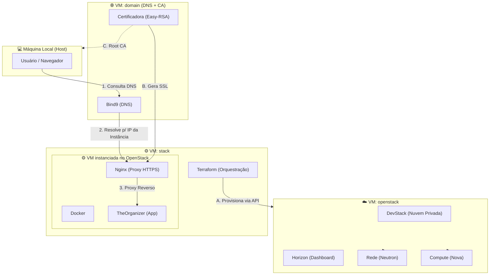

# 📑 ROTEIRO FINAL: Arquitetura de Nuvem Privada (TheOrganizer)

Este roteiro foca na explicação detalhada da infraestrutura utilizando o diagrama de fluxo de VMs.

---

## 📊 Arquitetura Detalhada da Solução

---

## 🎙️ Script Mastigado para a Gravação (7 a 12 min)

### 1. Introdução e Visão Geral (Rosto na câmera) - [1:30 min]
*   **FALA**: "Olá, professor. Sou a Milena e hoje vou apresentar a arquitetura de nuvem do **TheOrganizer**. Este projeto não é apenas uma aplicação, mas um ecossistema completo de nuvem privada que simula um ambiente de produção real."
*   **FALA**: "Minha infraestrutura é composta por três máquinas virtuais de base e uma instância dinâmica criada dentro do OpenStack."

### 2. Passo a Passo da Infraestrutura (Mostre o Diagrama) - [3:00 min]
*   **AÇÃO**: Mostre o diagrama Mermaid na tela.
*   **FALA**: "Vamos entender o fluxo por camadas:"
*   **FALA**: "Primeiro, temos a **VM: domain**. Ela é o nosso cérebro de rede. Nela configurei o **Bind9** para o DNS e o **Easy-RSA** como nossa Autoridade Certificadora. Sem ela, o usuário não conseguiria resolver o domínio `theorganizer.com` nem ter acesso HTTPS seguro."
*   **FALA**: "Em seguida, temos a **VM: openstack**. Aqui roda o DevStack, que nos fornece o Dashboard Horizon e os serviços de Compute e Network. É a nossa fundação de nuvem privada."
*   **FALA**: "O grande diferencial está na **VM: stack**. Nela, utilizei o **Terraform** para orquestrar e provisionar automaticamente a nossa instância final dentro do OpenStack. Isso significa infraestrutura como código (IaC)."

### 3. A Instância e a Segurança (Foco no Nginx/Docker) - [2:30 min]
*   **FALA**: "Dentro da instância criada pelo Terraform, temos três camadas:"
*   **FALA**: "1. O **Nginx**, que atua como Proxy Reverso e termina a conexão HTTPS usando os certificados da nossa CA."
*   **FALA**: "2. O **Docker**, que isola a nossa aplicação do sistema operacional."
*   **FALA**: "3. E o **TheOrganizer (FastAPI)**, que roda em um container, garantindo portabilidade."

### 4. Demonstração Prática (Navegador e Terminal) - [3:00 min]
*   **AÇÃO**: Mostre o site funcionando e depois dê um `multipass list` no terminal para mostrar as 3 VMs rodando.
*   **FALA**: "Como vocês podem ver, ao acessar o domínio, o DNS resolve corretamente e o cadeado do SSL está ativo graças à nossa CA Root importada na máquina local."
*   **FALA**: "O CRUD é totalmente funcional, salvando dados no MariaDB que também está orquestrado nesse ambiente."

### 5. Conclusão e Diferencial - [1:00 min]
*   **FALA**: "O diferencial deste projeto é o uso de **Terraform para orquestração automática no OpenStack** e a implementação de uma **CA própria com Easy-RSA**. Isso eleva o projeto de um simples site para uma solução completa de infraestrutura."
*   **FALA**: "Obrigado e estou à disposição para perguntas!"

---

## 🛠️ Termos Técnicos para Usar e Impressionar:
- **FQDN (Fully Qualified Domain Name)**: Use ao falar do endereço `cloud.theorganizer.com.br`.
- **Security Groups**: Use ao explicar como liberou as portas 80/443 no OpenStack.
- **Provisionamento**: Use para descrever o ato de criar as VMs.
- **Criptografia de Ponta a Ponta**: Ao falar do SSL/HTTPS.

---

## 💡 Lembre-se:
1.  **Aumente a fonte** do terminal.
2.  **Mostre o seu rosto** o tempo todo ou em momentos chave.
3.  O professor quer ver **competência** na infraestrutura!
